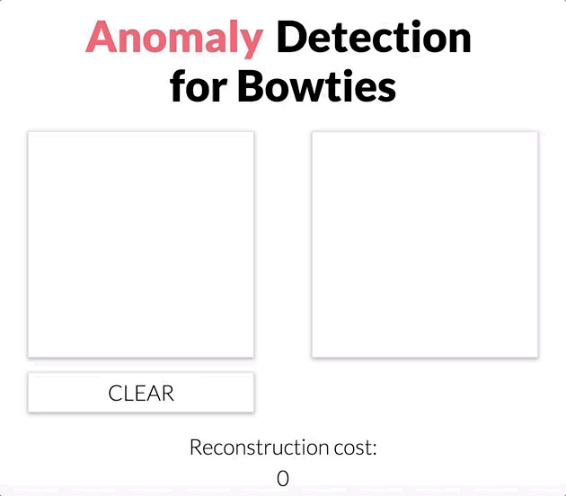

# anomalous_drawings
Flask app that detects anomalous bowtie drawings: https://anomaly-bowtie.herokuapp.com
(this link might load a bit slowly when you click it the first time)

This app uses a simple autoencoder to perform anomaly detection on bowtie drawings.
You can draw a bowtie (or anything) in the left canvas and the right canvas will
show you the autoencoder's reconstruction (784-32-782 model --> 28x28 image).
If your drawing is not a standard-looking bowtie (anomaly), the reconstruction canvas
(right) will turn red. A good reconstruction of your drawing will give a low cost (not anomaly)
while a bad reconstruction will give a high cost (anomaly). The anomaly threshold
is set at 0.07: error > 0.07 --> anomaly.

The flask app resides in the app _submodule_ and is hosted on heroku. This app
is responsive and has touch support (tested in Chrome).

**Data**: The bowtie drawings used to train the autoencoder are a subset of
Google's Quick, Draw! [dataset][data].

Notebook that explains **how anomaly detection can be performed via an autoencoder**:
[Bowtie Drawing Autoencoder](https://github.com/chen10an/anomalous_drawings/blob/master/Bowtie%20Drawing%20Autoencoder.ipynb)

Notebooks about the **autoencoder's implementation** can be found in my
ML algorithms [repository][other repo]. model.py and utils.py are based on this
repository's notebooks.
* Since Google's Quick, Draw! (preprocessed) dataset resembles the MNIST dataset
in its simplicity, I decided to reuse the autoencoder architecture I used for
the MNIST dataset on Google's dataset.

I used this HTML Canvas tutorial in my flask app: https://dev.opera.com/articles/html5-canvas-painting/

## Inspiration
* http://colinmorris.github.io/blog/bad_flamingos
* https://medium.com/@curiousily/credit-card-fraud-detection-using-autoencoders-in-keras-tensorflow-for-hackers-part-vii-20e0c85301bd

[data]: https://github.com/googlecreativelab/quickdraw-dataset
[other repo]: https://github.com/chen10an/ml_algos_python/tree/master/autoencoder
